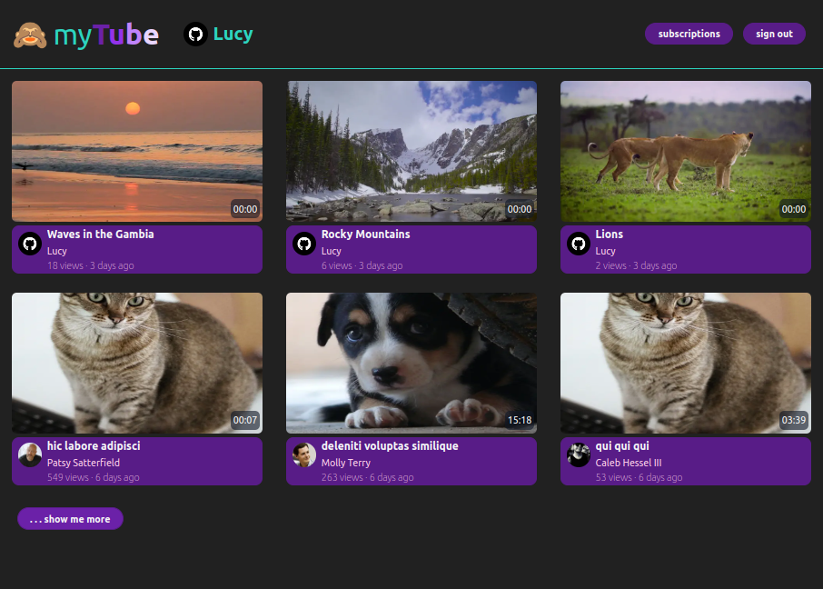
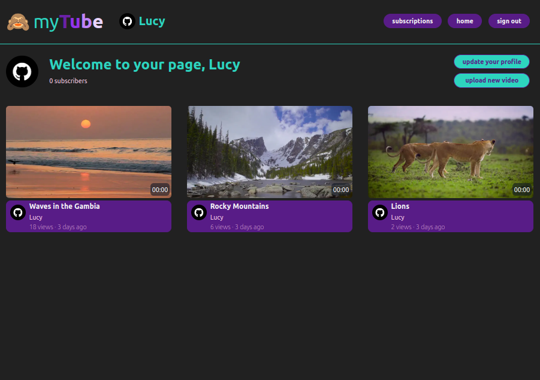
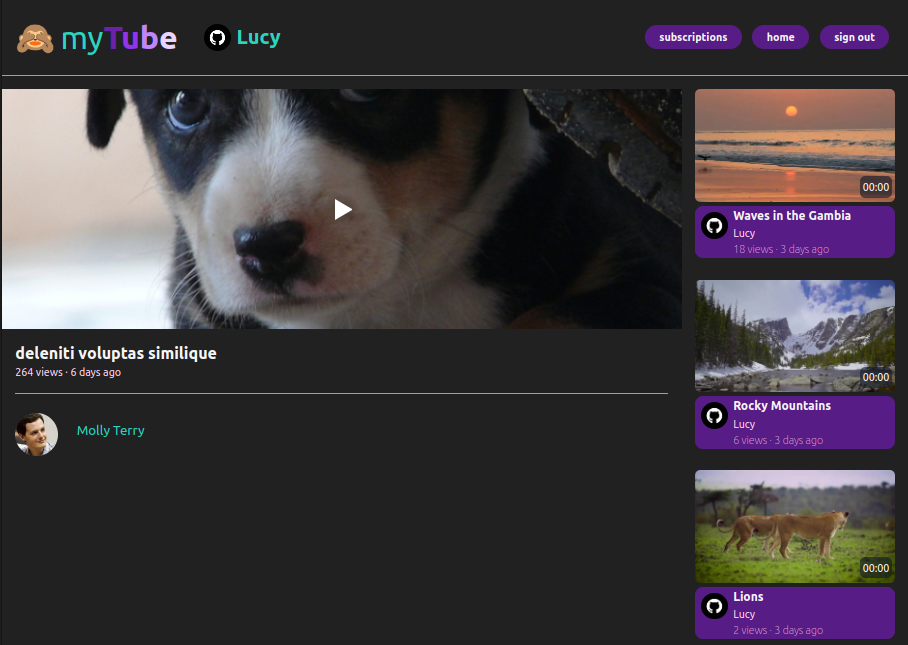

## myTube youtube clone

From a [tutorial](https://github.com/flaviocopes/bootcamp-2022-week-12-youtube) by [Flavio Copes](https://github.com/flaviocopes)

Video sharing app built in NextJS using ReactPlayer for playback.
Users can

-   set a username and avatar
-   see all videos on the paginated home page
-   visit other users' channel pages to see all their videos
-   subscribe to other users' uploads and see them on their own subscriptions page
-   upload their own videos and see them in their own channel

Uses Next-Auth for login, videos hosted in an AWS S3 Bucket, database hosted on Railway.app

Hosted on Vercel at https://mytube-xi.vercel.app/

### Personal additions

-   allows user to change personal details after sign-up, and prefills user details for existing users
-   return home button on all other pages
-   consistent header rendered once in \_app.js
-   styling with a combination of css and tailwindcss

### Credits

"Rocky Mountains": original video "Rocky Mountains Timelapse" by [mitchp](https://www.videvo.net/video/rocky-mountains-timelapse/3908/) on www.videvo.net. Used under Creative Commons License.

"Lions": orginal video "Two Lionesses Walking Together" by [`Stand Up for Nature`](https://www.videvo.net/video/pair-of-lionesses-walking-together/463057/) on www.videvo.net. Used under Videvo Attribution License.

"Waves in the Gambia": original video "Waves at Sunset" by [NatureClip](https://www.videvo.net/video/waves-at-sunset-in-hd-slow-motion-cc-by-natureclip/2089/) on www.videvo.net. Used under Creative Commons License.

Filler videos from [faker.js](https://github.com/faker-js/faker)

Filler thumbnails from [placeimg](http://placeimg.com)
